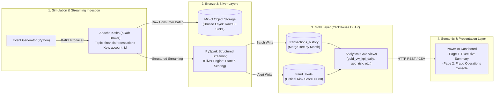

# Real-Time Financial Fraud Detection & Analytics Platform (FinTech)

[-blue.svg)](#architecture-overview)
[](#silver-layer--real-time-fraud-engine-pyspark)
[](#gold-layer--olap-warehouse-clickhouse)
[](#bi--analytics-layer-power-bi)

An end-to-end, enterprise-grade streaming and analytics platform designed to ingest, process, detect, and visualize banking fraud in real time. The system simulates high-throughput financial transactions, evaluates complex multi-factor risk rules in sub-second latency, stores partitioned dimensional data in an OLAP warehouse, and delivers an interactive two-page executive and operational intelligence dashboard in Power BI.

---

## Table of Contents
1. [Architecture Overview](#architecture-overview)
2. [Data Pipeline & Medallion Architecture](#data-pipeline--medallion-architecture)
   - [Event Generation & Statistical Simulation](#event-generation--statistical-simulation)
   - [Ingestion Layer (Apache Kafka)](#ingestion-layer-apache-kafka)
   - [Bronze Layer: Raw Landing Zone (MinIO / S3)](#bronze-layer-raw-landing-zone-minio--s3)
   - [Silver Layer: Real-Time Fraud Engine (PySpark)](#silver-layer-real-time-fraud-engine-pyspark)
   - [Gold Layer: OLAP Warehouse (ClickHouse)](#gold-layer-olap-warehouse-clickhouse)
3. [Business Intelligence & Analytics (Power BI)](#business-intelligence--analytics-power-bi)
   - [Page 1: Executive Summary](#page-1-executive-summary)
   - [Page 2: Fraud Operations & Critical Alerts](#page-2-fraud-operations--critical-alerts)
4. [Domain Concepts & Technical Glossary](#domain-concepts--technical-glossary)
   - [Financial & Risk Terminology](#1-financial--risk-terminology)
   - [Data Engineering & Streaming Concepts](#2-data-engineering--streaming-concepts)
   - [Data Modeling & BI Concepts](#3-data-modeling--bi-concepts)
5. [Repository Structure](#repository-structure)
6. [Quickstart & Deployment Guide](#quickstart--deployment-guide)

---

## Architecture Overview

The system follows a modern **Medallion Architecture (Bronze $\rightarrow$ Silver $\rightarrow$ Gold)** optimized for ultra-low latency event processing and instantaneous analytical querying:



---

## Data Pipeline & Medallion Architecture

### Event Generation & Statistical Simulation
Rather than injecting uniform random noise, the system employs **real-world financial statistical models** (`src/generator/`):
* **Amount Distribution (Log-Normal / Pareto)**: Natural purchase tickets follow a log-normal curve ($\mu = 3.5, \sigma = 0.72$), reflecting reality where $\sim80\%$ of purchases are small everyday expenses ($10 - $60 USD), with a decreasing long tail. Fraudulent transactions intentionally inject high-amount cashouts ($800 - $2,500 USD).
* **Circadian Rhythm (Non-Homogeneous Poisson Process)**: Realistic hourly fluctuations with deep valleys during early mornings (01:00 - 05:00), lunch peaks (12:00 - 14:00), and evening spending surges (18:00 - 21:00). Critical fraud exhibits elevated propensity during off-hours.
* **Calendar Seasonality**: Dynamic volume multipliers for payday surges (*Quincenas* on the 15th and 30th), weekend leisure spending, and summer shopping spikes.

### Ingestion Layer (Apache Kafka)
* Deployed in **KRaft mode** (no ZooKeeper dependency).
* **Partition Key**: Every event is partitioned strictly by `key = account_id`. 
  > **Why this matters**: Kafka guarantees strict chronological order *only within a single partition*. Partitioning by customer account ensures that an account's stateful transaction history is processed sequentially without race conditions.

### Bronze Layer: Raw Landing Zone (MinIO / S3)
* Raw JSON payloads are consumed by `src/bronze/bronze_consumer.py` and persisted in micro-batches directly to MinIO bucket `bronze/`.
* Preserves immutable, replayable audit logs for compliance, cold-storage archival, and ML retraining.

### Silver Layer: Real-Time Fraud Engine (PySpark)
A PySpark Structured Streaming engine (`src/streaming/`) processes micro-batches and maintains state across contiguous transactions per account:
1. **Rule 1: Impossible Travel Detection (Haversine Formula)**:
   Calculates the geodesic distance on Earth's surface between consecutive locations:
   $$d = 2R \cdot \arcsin\left(\sqrt{\sin^2\left(\frac{\Delta \text{lat}}{2}\right) + \cos(\text{lat}_1)\cos(\text{lat}_2)\sin^2\left(\frac{\Delta \text{lon}}{2}\right)}\right)$$
   If required travel speed $v = \frac{d}{\Delta t} > 800\text{ km/h}$ and distance $d > 150\text{ km}$, it flags physical impossibility (**+60 Risk Points**).
2. **Rule 2: High Velocity Burst Checking**:
   Evaluates a sliding window tracking frequency per account. If $> 3$ transactions occur within a 10-minute window, it detects a card testing / rapid cashout attack (**+40 Risk Points**).
3. **Rule 3: High Transaction Amount Anomaly**:
   If single purchase amount $\ge \$800.00\text{ USD}$, it triggers elevated scrutiny (**+20 Risk Points**).
4. **Scoring Threshold**:
   $$\text{Risk Score} = \min(100, \text{Score}_{\text{travel}} + \text{Score}_{\text{velocity}} + \text{Score}_{\text{amount}})$$
   * $\text{Risk Score} > 80 \implies \mathbf{is\_fraud = 1}$ (Critical Incident $\rightarrow$ written to `fraud_alerts`).
   * $\text{Risk Score} \le 80 \implies \mathbf{is\_fraud = 0}$ (Standard audit record).

### Gold Layer: OLAP Warehouse (ClickHouse)
ClickHouse serves as the real-time analytical engine, offering instant columnar scans over millions of records:
* **`transactions_history`**: Partitioned by `toYYYYMM(timestamp)` and indexed by `(account_id, timestamp, transaction_id)`.
* **`fraud_alerts`**: Filtered partition of critical alerts with detailed flattened reason arrays.
* **Curated Gold Views**:
  * `gold_vw_kpi_daily`: Daily aggregated volume, fraud amount, compromised accounts, and average risk score.
  * `gold_vw_fraud_by_reason`: Unnested root-cause metrics via `arrayJoin(reasons)`.
  * `gold_vw_merchant_category_risk`: Risk concentration across commercial sectors.
  * `gold_vw_geo_risk`: Geospatial risk distribution across international hub cities.

---

## Business Intelligence & Analytics (Power BI)

The presentation layer connects directly to ClickHouse HTTP endpoints (`:8123`) using **CSVWithNames** streaming protocols, modeled as a **Kimball Star Schema** anchored by a central `Dim_Calendar`.

### Page 1: Executive Summary
Designed for C-Level executives, VP of Risk, and Compliance Directors:
* **Top KPI Row (5 Dynamic Cards with MoM Intelligence)**:
  * **Total Transactions**: Operational scale ($122.4\text{K}$).
  * **Fraud Rate (%)**: Key regulatory SLA benchmark ($2.62\%$).
  * **Total Fraud Exposure**: Intercepted threat volume ($\$2.95\text{M}$).
  * **Compromised Accounts**: Impacted client base ($476$ accounts).
  * **Average Risk Score**: Platform threat temperature ($10.2 / 100$).
* **Middle Panoramic Panel (1327 x 276 px)**:
  * *Transaction Volume & Fraud Rate Trend*: Dual-axis timeline crossing daily processed volume with the red fraud rate trajectory.
  * *Fraud Exposure by Reason*: Horizontal breakdown showing financial exposure by attack vector (*Velocity Burst*, *Impossible Travel*, *High Amount*).
* **Bottom Quadrants (651 x 279 px & 650 x 279 px)**:
  * *Merchant Category Risk*: Risk concentration showing cash advance and luxury goods as high-vulnerability targets.
  * *Geographic Threat Distribution*: Multi-city bubble map proportional to capital at risk.

### Page 2: Fraud Operations & Critical Alerts
Designed for SOC engineers, fraud investigators, and compliance officers:
* **Triage Cards (3 Core Metrics)**:
  * `Critical Alerts` ($3,213$), `Total Fraud Exposure` ($\$2.95\text{M}$), `Compromised Accounts` ($476$).
* **Panoramic Incident Investigation Table (1327 x 340 px)**:
  * Full real-time audit log featuring `alert_datetime`, `account_id`, `city`, `amount`, `risk_score`, and `fraud_reasons`.
* **Interactive Bottom Diagnostics (650 x 240 px each)**:
  * *Alerts by Detection Rule*: Cross-filtering trigger frequency.
  * *Critical Incidents by Location*: City rankings allowing instant drill-down into specific regional incidents.

---

## Domain Concepts & Technical Glossary

### 1. Financial & Risk Terminology

* **Fraud Exposure (Amount at Risk)**:
  The cumulative monetary volume of transactions flagged as fraudulent. In real-time detection, this represents **intercepted/prevented threat volume**, not direct bank losses.
* **Net Fraud Loss**:
  The actual capital permanently lost to unauthorized transactions that bypassed security controls and resulted in unrecoverable chargebacks.
* **Chargeback**:
  A forced transaction reversal initiated by the cardholder's issuing bank following confirmed unauthorized activity.
* **Card Testing Attack**:
  An automated attack vector where cybercriminals run multiple low-value authorizations in seconds across e-commerce gateways to validate stolen card numbers before executing large cashouts.
* **Velocity Attack**:
  A rapid succession of high-frequency purchases executed on a single card within minutes, attempting to drain account balances before security blocks trigger.
* **Impossible Travel (Geo-Velocity Anomaly)**:
  A security violation triggered when successive transactions on the same account occur at geographic locations whose required transit speed exceeds commercial aviation limits ($> 800\text{ km/h}$).

---

### 2. Data Engineering & Streaming Concepts

* **Medallion Architecture**:
  A data design pattern that logically organizes data into three refinement tiers:
  * **Bronze (Raw)**: Unprocessed, append-only source records.
  * **Silver (Cleaned & Enriched)**: Validated, state-tracked, and scored data.
  * **Gold (Aggregated & Curated)**: Business-level analytical views optimized for consumption.
* **Sliding Window vs. Tumbling Window**:
  * *Tumbling Window*: Fixed, non-overlapping time buckets (`[10:00-10:01]`, `[10:01-10:02]`). Vulnerable to boundary-straddling attacks.
  * *Sliding Window*: Continuously evaluated time windows anchored to the event timestamp looking back $N$ minutes, reliably capturing burst anomalies regardless of minute boundaries.
* **Partition Key**:
  The hashing attribute assigned to Kafka messages (`key = account_id`). Guarantees that all events belonging to the same entity land on the same broker partition, preserving absolute chronological order.
* **Watermark**:
  A streaming mechanism in PySpark that bounds late-arriving event data, enabling state cleanup and preventing unbounded memory growth.
* **OLAP vs. OLTP**:
  * *OLTP (Online Transaction Processing)*: Row-oriented databases optimized for fast transactional reads/writes (e.g., PostgreSQL).
  * *OLAP (Online Analytical Processing)*: Columnar engines optimized for scanning millions of rows across analytical aggregations in milliseconds (e.g., ClickHouse).

---

### 3. Data Modeling & BI Concepts

* **Kimball Star Schema**:
  A dimensional modeling technique consisting of a central **Fact Table** containing quantitative metrics, linked to **Dimension Tables** containing qualitative descriptive context.
* **Atomic Grain**:
  The lowest, most detailed level of data recorded in a fact table (e.g., a single individual transaction rather than a daily summary). Preserving atomic grain enables multi-dimensional slicing without pre-computation data loss.
* **Conformed Dimension**:
  A shared dimension (such as `Dim_Calendar`) that connects across multiple disparate fact or aggregate tables, enabling unified cross-filtering and synchronized slicers across the entire report.
* **Cross-Filtering**:
  The ability of modern BI engines to propagate filter context bidirectionally: clicking a city in a map immediately restricts the scope of adjacent bar charts, tables, and KPI cards.
* **Time Intelligence & Month-over-Month (MoM)**:
  Analytical calculations comparing performance in the current period versus identical preceding intervals (e.g., $\Delta\text{Fraud Rate} = \text{Rate}_{\text{current}} - \text{Rate}_{\text{prev\_month}}$).

---

## Repository Structure

```text
├── docker/
│   ├── docker-compose.yml          # Kafka, MinIO, Spark, ClickHouse orchestration
│   ├── Dockerfile.generator        # Container image for data generator & bronze consumer
│   ├── Dockerfile.spark            # PySpark Structured Streaming image
│   ├── init-clickhouse.sql         # Base database, tables & Gold analytical views
│   └── gold_views.sql              # Standalone Gold Layer SQL reference scripts
├── src/
│   ├── generator/
│   │   ├── config.py               # Reference locations, rates & Kafka topics
│   │   ├── generator.py            # Live streaming event generator
│   │   ├── models.py               # Pydantic schemas (TransactionEvent, Enums)
│   │   ├── scenarios.py            # Attack generators (Velocity, Travel, Midnight)
│   │   └── seed_historical_data.py # Statistical backfill (Jan - Sep 2026, 122K rows)
│   ├── bronze/
│   │   ├── config.py               # MinIO credentials & batch flush thresholds
│   │   └── bronze_consumer.py      # Kafka-to-S3 raw streaming archiver
│   └── streaming/
│       ├── pipeline.py             # PySpark Structured Streaming engine
│       ├── rules.py                # Haversine distance, velocity & scoring logic
│       └── schemas.py              # PySpark StructType schemas
├── resources/
│   ├── Visualization.pbix          # Production Power BI Dashboard (2-page suite)
│   └── Fraud-Detection.png         # Architectural blueprint & UI previews
├── pyproject.toml                  # Poetry dependencies & project metadata
└── README.md                       # Comprehensive technical documentation
```

---

## Quickstart & Deployment Guide

### Prerequisites
* Docker Desktop & Docker Compose
* Python 3.11+ / Poetry
* Power BI Desktop (Windows)

### 1. Launch Platform Infrastructure
Start the entire streaming and OLAP ecosystem:
```bash
cd docker
docker compose up -d
```
Verify container health:
```bash
docker ps --format "table {{.Names}}\t{{.Status}}\t{{.Ports}}"
```

| Service | Container Name | Local Endpoint |
| :--- | :--- | :--- |
| **Apache Kafka** | `fraud-kafka` | `localhost:9092` |
| **Kafka UI** | `fraud-kafka-ui` | `http://localhost:8085` |
| **MinIO Console** | `fraud-minio` | `http://localhost:9001` (user: `minioadmin` / pass: `minioadminpassword`) |
| **ClickHouse HTTP** | `fraud-clickhouse` | `http://localhost:8123` (user: `default` / pass: `clickhouse123`) |

### 2. Seed Historical Dataset (Jan 1 – Sep 15, 2026)
Execute the statistical backfill generator to seed 122,000+ realistic records with seasonal and circadian curves into ClickHouse:
```bash
docker cp src/generator/seed_historical_data.py fraud-spark-streaming:/app/src/generator/seed_historical_data.py
docker exec -e CLICKHOUSE_HOST=clickhouse fraud-spark-streaming python -m src.generator.seed_historical_data
```

### 3. Open Power BI Dashboard
1. Launch **Power BI Desktop** and open [`resources/Visualization.pbix`](resources/Visualization.pbix).
2. Click **Refresh** on the Home tab. 
3. All Gold Views (`gold_vw_kpi_daily`, `gold_vw_fraud_alerts`, `gold_vw_merchant_category_risk`, `gold_vw_geo_risk`, `gold_vw_fraud_by_reason`) will hydrate in seconds via ClickHouse HTTP streaming.

---

### Author & Engineering Credits
Developed as an enterprise-grade reference architecture for real-time banking risk intelligence.
