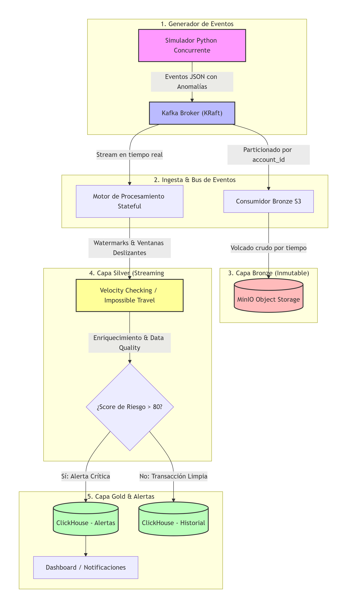
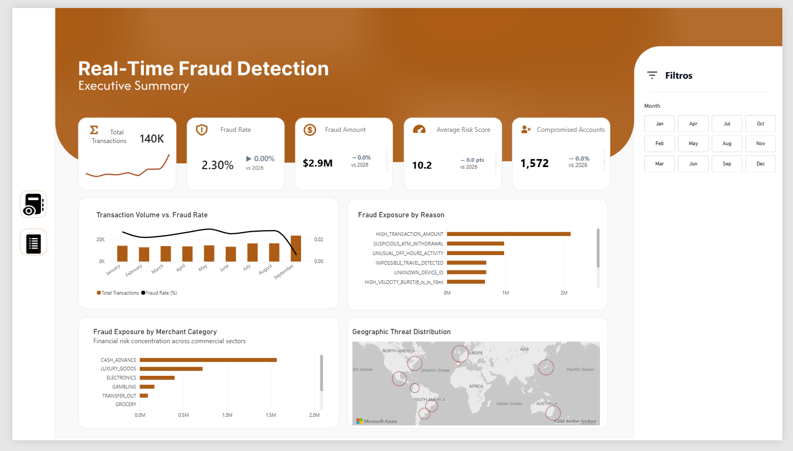
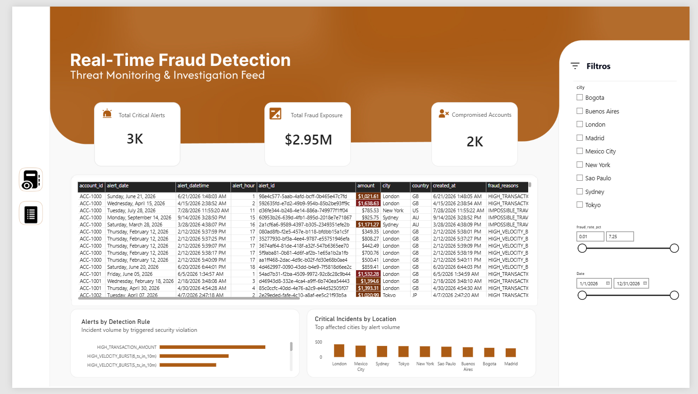

Real-Time Financial Fraud Detection Platform
---
## 1. Concepts & Engineering Learning

### This project was developed as a hands-on deep dive into modern, enterprise-grade Data Engineering architectures.
> The primary objective was to learn distributed streaming systems, stateful real-time computation, and high-performance OLAP data modeling by working with a robust, production-ready tech stack (Apache Kafka, PySpark, ClickHouse, and Power BI). Beyond building a functional pipeline, this initiative served to bridge theory with practice—solidifying core concepts such as event ordering guarantees, sliding window heuristics, and Kimball dimensional modeling.

### Conceptual things that I learn doing this project & Stack Integration

| Core Concept learned                     | Practical Competency & Evidence                                                                                                          | Modern Tech Stack                                                          |
|:-----------------------------------------|:-----------------------------------------------------------------------------------------------------------------------------------------|:---------------------------------------------------------------------------|
| **Strict Event Ordering Guarantees**     | Prevented race conditions and state collisions across 500 concurrent accounts by ensuring deterministic partition routing.               | **Apache Kafka (KRaft)**<br>`key = account_id` message hashing             |
| **Stateful Stream Processing & CEP**     | Detected multi-factor anomalies and transit violations in sub-second latency across contiguous temporal horizons.                        | **PySpark Structured Streaming**<br>Sliding windows & Haversine heuristics |
| **Medallion Architecture (Bronze Tier)** | Established an immutable, audit-compliant raw landing zone decoupled from high-velocity analytical serving.                              | **MinIO (S3 Lake)**<br>Micro-batch raw JSON partition sinks                |
| **High-Throughput Columnar OLAP**        | Accelerated analytical aggregations to $< 15\text{ ms}$ over 122K+ records via partition pruning and primary indexing.                   | **ClickHouse DB**<br>`MergeTree` engine & monthly partitions               |
| **Kimball Dimensional Modeling**         | Eliminated isolated pre-aggregated silos, unlocking 360° bidirectional cross-filtering and Month-over-Month (MoM) telemetry.             | **Power BI Desktop & DAX**<br>Star Schema with conformed `Dim_Calendar`    |
| **Financial Statistical Simulation**     | Synthesized realistic banking behavior (bimodal circadian curves, payday spikes, fat-tail fraud tickets) instead of uniform white noise. | **Python 3 & Pydantic**<br>Log-Normal & Poisson distributions              |


---

## 2. System Architecture & Component Breakdown

The platform implements an enterprise **Medallion Architecture (Bronze $\rightarrow$ Silver $\rightarrow$ Gold)**:

<p align="center">
  
</p>

### 2.1 Technology Selection & Architectural Decisions

Rather than assembling tools arbitrarily, each technology was selected prior to development as a proactive solution to a critical distributed systems challenge:

* **Apache Kafka (KRaft Mode)**:
  * **The Anticipated Problem**: High-volume, concurrent financial events arriving out of order across parallel consumer threads. In banking, processing a withdrawal before an earlier balance authorization leads to false approvals or catastrophic race conditions.
  * **The Architectural Decision**: I adopted Kafka in KRaft mode to enforce partition hashing by `key = account_id`. This guarantees that every transaction for a specific customer is queued strictly sequentially in the same partition, eliminating state race conditions while removing ZooKeeper operational overhead before scaling throughput.
* **MinIO (S3-Compatible Object Storage)**:
  * **The Anticipated Problem**: Regulatory audit compliance and potential downstream pipeline corruption. If streaming transformations or scoring logic ever fail, without an immutable raw landing zone, the original financial event truth is lost permanently. And it's compatible with S3 AWS.
  * **The Architectural Decision**: I introduced MinIO as a decoupled Bronze tier and the ability to replay historical streams whenever detection models require backfilling.
* **PySpark (Structured Streaming)**:
  * **The Anticipated Problem**: Fraud patterns spanning across multiple transactions over time (rapid-fire card testing and cross-continental travel jumps) that cannot be detected by traditional, stateless row-by-row event processors.
  * **The Architectural Decision**: I selected PySpark to maintain distributed in-memory state per account across sliding time windows. This enables complex event processing (CEP) heuristics—such as Haversine geodesic distance anomalies and 10-minute velocity thresholds—with fault-tolerant checkpointing to prevent data loss during node restarts.
* **ClickHouse (Columnar OLAP Warehouse)**:
  * **The Anticipated Problem**: Traditional relational databases (PostgreSQL/MySQL) locking up and degrading when forced to handle high-frequency streaming writes concurrently with heavy multi-month analytical scans for BI dashboards.
  * **The Architectural Decision**: I deployed ClickHouse for the Gold analytical tier. Its columnar `MergeTree` architecture and vectorized SIMD execution allow simultaneous high-throughput ingestion and sub-15ms aggregations across millions of rows, serving Power BI directly over HTTP without requiring pre-aggregated cache layers.
* **Power BI & Star Schema Semantic Layer**:
  * **The Anticipated Problem**: Business stakeholders demanding 360° dynamic drill-downs (filtering simultaneously by date, city, and merchant category) while rigid pre-aggregated reporting views isolate data into incompatible silos.
  * **The Architectural Decision**: I established a Kimball Star Schema linked to a conformed `Dim_Calendar`. Leveraging Power BI’s in-memory columnar engine (**VertiPaq**) allows me to deliver instantaneous cross-filtering across all visuals, robust Month-over-Month (MoM) Time Intelligence, and custom vector security badges without sacrificing performance.
* **Docker & Docker Compose**:
  * **The Anticipated Problem**: "Works on my machine" inconsistencies across multi-service distributed architectures (Kafka broker, Spark workers, MinIO, ClickHouse) and networking collision during deployment.
  * **The Architectural Decision**: I containerized the entire distributed cluster with dedicated healthchecks and network isolation (`fraud-network`), ensuring consistent local execution that mirrors cloud production environments.

## 3. Architectural Trade-Offs & Key Decisions

* **Why Sliding Window instead of Tumbling Window?**
  * *Tumbling windows* divide time into rigid blocks (`10:00–10:01`), creating blind spots where an attacker can execute 2 transactions at `10:00:59` and 2 at `10:01:01` undetected. 
  * *Sliding windows* look back continuously $N$ minutes from the exact transaction timestamp, eliminating boundary exploits.
* **Why Atomic Star Schema instead of Isolated Pre-Aggregations?**
  * Pre-aggregating individual views per chart destroys cross-dimensional context (city cannot filter merchant category; category cannot filter date).
  * Linking atomic or daily fact tables to conformed dimensions (`Dim_Calendar`) enables **360° cross-filtering**: clicking any city, category, or date slicer synchronizes all visual elements simultaneously.
* **Why "Fraud Exposure" instead of "Lost Money"?**
  * Sub-second streaming detection intercepts fraud **before funds settle**. Flagged transactions represent **prevented threats and protected capital**, not direct financial losses.

---

## 4. Power BI Dashboard Suite

### Page 1: Executive Summary (Strategic Risk Oversight)
Designed for C-Level leadership and Risk Directors to evaluate macroeconomic health and capital exposure:
* **Executive KPI Strip**: 5 synchronized metrics tracking operational scale, fraud rate (%), total intercepted exposure, and compromised accounts with dynamic **Month-over-Month (MoM) variance indicators**.
* **Panoramic Timeline**: Daily transaction flow crossing normal volume against fraud rates to uncover payday (*Quincena*) spikes.
* **Threat & Sector Allocation**: Root-cause analysis by attack rule (*Velocity*, *Travel*, *High Amount*) and vulnerability concentration in cash-advance and luxury retail.

<p align="center">
  
</p>

---

### Page 2: Fraud Operations & Incident Queue
Designed for fraud analysts and security engineers to investigate and remediate active threats in real time:
* **Triage Cards**: Active operational counts of unverified alerts, capital currently at risk, and accounts requiring account lock/review.
* **Panoramic Incident Audit Table**: Real-time investigation feed featuring timestamp telemetry, account IDs, high-contrast risk score backgrounds ($95-100$ crimson neons), and violation reason tags.
* **Interactive Threat Drill-Down**: Instant cross-filtering by clicking attack rules or affected international hub cities.

<p align="center">
  
</p>

## 5. Deployment & Verification (3 Steps)

```bash
# Step 1: Launch Streaming & OLAP Infrastructure
cd docker && docker compose up -d

# Step 2: Seed Calibrated Historical Dataset (Jan 1 – Sep 15, 2026 / 122K transactions)
docker exec -e CLICKHOUSE_HOST=clickhouse fraud-spark-streaming python -m src.generator.seed_historical_data

# Step 3: Open & Hydrate Power BI Suite
# Launch resources/Visualization.pbix in Power BI Desktop and click "Refresh".
```

---
*For in-depth code modules and raw configuration files, refer to [`README Architecture PJ info.md`](./README%20Architecture%20PJ%20info.md).*
